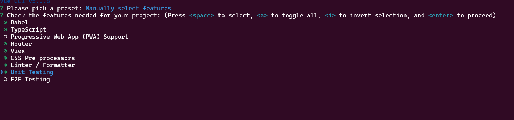
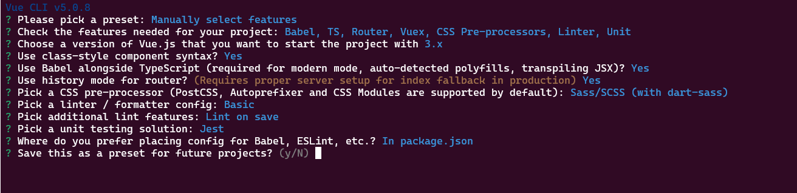

# skeleton

## Creation process

### Features

### Specifications

## After creation

### Dependencies

npm install vue-i18n
npm install quasar
npm install @quasar/extras

### Scripts

add : "i18n:report": "vue-cli-service i18n:report --src \"./src/**/\*.?(js|vue)\" --locales \"./src/locales/**/\*.json\""

### tsconfig.json

add : "compilerOptions": {
"resolveJsonModule": true,
...
}

### config files

add : quasar.user-options.ts
i18n.ts
apply changes: use quasar and i18n in main.ts
